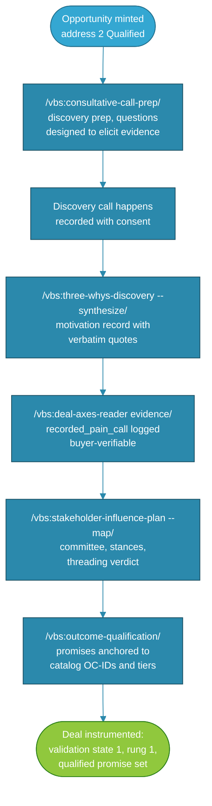

# Claude for Value-Based Selling: Solo Sales Cookbook

**Audience:** Individual sellers (founder-sellers, solo AEs, first sales hires, quota-carrying CSMs) deploying the vbs and vfa plugins for solo use
**Status:** [PROPOSED]
**Purpose:** Specific, step-by-step operational guide for configuring and using the Value-Based Selling expansion pack across the pre-sale revenue phase, from value-fit gating through the sales-to-CS seam.
**Companion:** `solo-post-sales-cookbook.md` picks up where this cookbook ends, at the seam. The two cookbooks share one model of the revenue lifecycle (the Expanded Triaxial Model), one outcome catalog, and one running scenario: the deal this cookbook works is the account the Solo Post-Sales Cookbook receives.

---

## Who This Is For and How It's Deployed

This cookbook is written for a **single seller deploying the expansion pack for personal use**: not an enterprise sales-ops rollout, not a RevOps administrator provisioning a team. You are the only person running the cold-start interviews. Your deals, your evidence, your pipeline. Every gate verdict, every drift digest, and every commitment draft belongs to your session context.

That framing shapes how to think about the system:

**What "solo seller" means for plugin behavior:**

The plugins assume a single-user context throughout. When `deal-alignment-watcher` flags a slipping deal, it flags it to *you*. When the good-sale-gate says a deal is Fragile, that verdict is a private working instrument, not a forecast submission. When the cold-start interviews write your config, they capture *your* catalog, *your* buyer personas, *your* commercial boundary.

One thing is deliberately different from a typical sales tool: **this system is built to keep you honest with yourself.** Solo sellers have no sales manager applying skepticism to their deals, which means happy ears go unchallenged. The buying-readiness ladder, the validation-state divergence read, and the keepability gate are the skeptical sales manager you do not have. They compute from evidence, and they cannot be argued with, only evidenced.

**What you should expect from this deployment:**

- **Two cold-starts, both yours.** Part 0 walks through the vbs interview (your catalog, personas, deal workspace, commercial boundary) and the vfa interview (your ICP, PMF evidence, vendor economics, governance budgets). Run each once; everything downstream inherits from them.

- **Gates before deals.** The vfa side (ICP scorecard, ICVP composite scorer) decides which accounts deserve your finite time before a deal exists. For a solo seller this is the discipline with the biggest payoff in the pack: you cannot afford to work deals that were never real.

- **Craft inside deals.** The vbs skills run your deal work: discovery that produces records instead of notes, promises qualified against the catalog before they reach a buyer, narratives and negotiation prep built from evidence.

- **Agents that watch while you sell.** Three scheduled agents cover what a solo seller never has time to re-check: weekly deal drift, monthly acquisition drift, and the quarterly feedback loop.

- **A seam that arrives complete.** When you close won, the commitment drafts, verbatim Expected Value Baseline plan, and frozen deal-axes readings cross to the post-sale side as a package. If you are also the person doing onboarding (many solo sellers are), the package you build here is the one future-you thanks present-you for.

**What this cookbook does not cover:**

Team and enterprise deployment; marketing-side funnel tooling (Visitor through MQL is outside the pack's scope; the model's funnel stages are described for orientation only); renewal pricing and commercial-terms execution (the renewals plugin owns that motion; this pack supplies the influence and negotiation methodology up to your configured commercial boundary); and post-sale lifecycle operations, which are the Solo Post-Sales Cookbook's territory.

---

> **⚠️ Reference Build: Tailoring Required**
>
> The plugins described here are **reference builds**, not plug-and-play deployments. The architecture and workflows are proven, but they are designed around generalizable patterns, not any specific company's systems, terminology, or sales motion.
>
> **Every deployment requires tailoring before it produces useful output.** Specifically:
>
> - **The Outcome Catalog is the load-bearing prerequisite.** Nearly every vbs skill qualifies promises against it, and the ICVP scorer maps pains to it. If you deployed the CS suite first, you already have it; if not, build it first (§0.3). Without it, outcome qualification degrades to seller judgment, which is the exact failure this pack exists to prevent.
> - **ICP and economics are yours to supply.** The ICVP scorer's firmographic gate, industry tiers, and vendor cost model default to generic values; the vfa cold-start replaces them.
> - **Evidence kinds are a starting taxonomy.** The deal-axes engine ships with an admissible-evidence list; extend it deliberately, never casually (what counts as evidence is a governance decision).
> - **The commercial boundary must be declared.** Even solo, decide what you will not negotiate away before pressure exists, and put it in config.
>
> The two cold-start interviews (§0.1, §0.2) are the tailoring mechanism. Skipping them means the pack operates on defaults that will not reflect your context.

---

## Quick Start: First Value in Under 40 Minutes

### Step 1: Install the plugins (5 minutes)

Install `vbs` and `vfa` from `dist/` (Cowork: Settings → Capabilities; Claude Code: per §0.0 of the Solo Post-Sales Cookbook, same mechanics). If the CS suite is already installed, both compose with it automatically; if not, they run standalone.

### Step 2: Run both cold-starts (15 minutes)

```
/vbs:cold-start-interview
/vfa:cold-start-interview
```

The vbs interview needs your catalog location, buyer personas, deal workspace convention, and commercial boundary. The vfa interview needs your ICP location, PMF evidence status, vendor cost model, and governance budgets. Quick-start answers are fine; `/vbs:customize` and `/vfa:customize` refine later.

### Step 3: Confirm the catalog (10 minutes)

If you have no Outcome Catalog yet, see §0.3. Verify the tier vocabulary in one command:

```
/vfa:deliverability-taxonomy-reconciler [your catalog file]
```

A canonical verdict means everything downstream can trust the tiers.

### Step 4: Your first skill command (10 minutes)

Run the gate on the deal closest to close:

```
/vbs:good-sale-gate --deal [your most advanced deal]
```

You will get a keepability verdict (Keep-Ready / Fixable / Fragile) and a prioritized fix list. Most first runs come back Fixable with an empty value-evidence plan as the top fix. That is normal, and fixing it now is cheaper than discovering it at renewal.

---

## How to Use This Cookbook

Parts 1 through 5 follow the Expanded Triaxial Model's opportunity pipeline: the seven-stage backbone from Prospecting to Closed, then across the seam. Each part has an entry condition, a reference table of commands, a flow, the running scenario, and the managed-agent coverage for that stretch of the pipeline. Work the part your deal is in; the parts compose but do not require each other.

### Reading Conventions

- `/vbs:skill-name` and `/vfa:skill-name` are slash commands you invoke; agents (loop-runner, drift-sentinel, deal-alignment-watcher) have no slash commands and run on schedule.
- "Instrument" always means one of the two ETM pre-sale readings: the value-validation state or the buying-readiness ladder. Instruments are computed by `/vbs:deal-axes-reader`; nothing you or Claude declares can move them.
- ETM pipeline addresses are numbered 1 Prospecting through 7 Closed. Pipeline math (coverage, forecast, win rate) starts at 2 Qualified; Prospecting records never count.

### When You're Unsure Which Command to Run

| You are trying to... | Run |
|---|---|
| Decide if an account is worth pursuing at all | `/vfa:icvp-composite-scorer` |
| Prepare or synthesize discovery | `/vbs:three-whys-discovery` |
| Check whether you may promise something | `/vbs:outcome-qualification --check "<claim>"` |
| See where a deal really stands | `/vbs:deal-axes-reader read` |
| Know if a deal will survive its first renewal | `/vbs:good-sale-gate` |
| Get ready for a pricing conversation | `/vbs:negotiation-prep` |
| Close a deal, any outcome | `/vbs:deal-axes-reader close` then (won only) `/vbs:value-commitment-builder` |

---

## What This Changes for Your Day

Before: your pipeline review is a list of stages you set yourself, your promises live in email threads, and the only check on your optimism is the quarter's end. After: every deal carries three readings (address, validation state, readiness ladder), every promise carries a catalog anchor and a tier, the weekly digest tells you which deals drifted while you were selling the others, and the close produces a package instead of a scramble. The daily experience is that Claude stops being a writing assistant for seller-optimism and becomes the colleague who asks "what did the buyer verifiably do?"

---

## Understanding Managed Agents

The pack ships three scheduled agents. All three are depth-0 (no subagents), read-and-report, and structurally incapable of changing a gate, weight, or classification without your approval. Detailed reference architecture for each lives in `managed-agent-cookbooks/`.

| Agent | Plugin | Cadence | What it produces |
|---|---|---|---|
| `deal-alignment-watcher` | vbs | Weekly (Friday) | Late-stage keepability drift digest: gate regressions, SLIPPING divergences, the EVB-unscheduled list |
| `drift-sentinel` | vfa | Monthly | Sellability-drift report: Shadow-ICP clusters, override audit, FM-C/D trend |
| `loop-runner` | vfa | Quarterly | The feedback-loop readout: R1-R4 write-back routing, weights re-fit as PROPOSAL only |

**What they cannot do:** send anything to a buyer, write a deal workspace, apply a weights change, reclassify a segment, or fabricate a verdict for a deal with missing records. When an agent output says PROPOSAL, a human (you) approves or declines; there is no auto-apply path anywhere in the pack.

**Solo activation guidance:** activate `deal-alignment-watcher` as soon as you have one gated deal; activate `drift-sentinel` and `loop-runner` once ICVP scoring and closed outcomes exist to aggregate (a fresh deployment's first months of sentinel reports will correctly say "no records," which is honest, not broken).

---

## Required Plugins and Companion Resources

| Plugin | Required | Provides |
|---|---|---|
| `vbs` | Yes | 13 deal-craft skills + config pair + deal-alignment-watcher |
| `vfa` | Yes | 9 acquisition-system skills + config pair + loop-runner + drift-sentinel |
| `rev-ops` | Strongly recommended | The Outcome Catalog authoring skills and its single write path; handoff quality scoring (dimension 6 activates when vbs is present) |
| `renewals` | Optional (solo sellers who own renewals) | Renewal forecast, risk, and commercial execution; consumes this pack's renewal-influence work |
| CS suite (`csm`, `onboarding`, ...) | Optional | The post-seam half; the Solo Post-Sales Cookbook governs it |

Command format: `/plugin:skill-name [target] --flag value`. Engine-backed skills (`icvp-composite-scorer`, `deal-axes-reader`, `value-bridge-realization-tracker`, `deliverability-taxonomy-reconciler`) run their bundled scripts; outputs are computed, not improvised.

---

## Part 0: One-Time Setup

### 0.1 vbs Cold-Start Interview

```
/vbs:cold-start-interview
```

Six sections: Outcome Catalog location (and tier vocabulary confirmation), buyer personas with the metric each answers for, selling motion, deal workspace convention, commercial boundary, and evidence-plan defaults. The commercial boundary deserves real thought even solo: it is the line past which `negotiation-prep` will refuse to help you concede, which is exactly what you want it to do at 6 PM on quarter-end day.

### 0.2 vfa Cold-Start Interview

```
/vfa:cold-start-interview
```

Six sections: PMF status by segment (if none, the interview says plainly that acquisition spend ahead of validated fit is the premature-scaling anti-pattern and offers the two PMF skills first), ICP and negative-ICP location with hard-fail criteria, catalog location, vendor cost model, signal half-lives, and governance (override budget; solo, you are your own Loop 3 reviewer, and the audit trail still matters because it keeps you honest across quarters).

### 0.3 The Outcome Catalog Prerequisite

If the CS suite is deployed, your catalog already exists and both packs share it; nothing to do beyond §Quick Start Step 3. If not, build a provisional catalog with the rev-ops authoring skills (`provisional-outcome-catalog-generator`, then `outcome-catalog-entry-builder` to refine), validate against the quality rubric, and only then let vbs skills qualify promises against it. The rule the whole pack enforces: an outcome may be committed only at a sales-eligible evidence tier (Fully, Partially, or Conditionally Deliverable) and never roadmap-dependent; Partially states its subset, Conditionally states its conditions.

### 0.4 Understanding the Deal Axes

Every deal in this pack carries three readings, per the Expanded Triaxial Model:

- **Address:** where the deal stands on the seven-stage pipeline. You declare this; the system records who declared it.
- **Validation state (parallel):** whether the value story is being proven, five states from Problem Evidenced to Business Case Accepted, moved only by what the buyer verifiably did.
- **Readiness ladder (inferred):** how real the deal is, seven rungs from Pain Evidenced to Commitment Evidenced, computed bottom-up with the first missing rung governing.

The instrument everyone learns to respect first is the divergence read: a deal declared at Proposal while validation sits at Problem Evidenced is the slipping deal, caught structurally instead of by a sales manager's feel. Record evidence as it happens (`/vbs:deal-axes-reader evidence ...`), and the readings stay current for free.

### 0.5 Activate Managed Agents

Schedule `deal-alignment-watcher` weekly (Friday morning, ahead of your own pipeline review), `drift-sentinel` monthly, `loop-runner` quarterly. Each agent's cookbook in `managed-agent-cookbooks/` covers configuration, output spec, and troubleshooting.

### 0.6 Connect Your Data Sources

The pack runs on local deal workspaces by default; a CRM connector enriches ICVP inputs and lets you sync records outward, but nothing in the pack writes your CRM. If you connect one, the read-only posture is deliberate: v1 treats external content as untrusted for instrument purposes (a CRM note is not buyer-verifiable evidence; a recorded call the buyer confirmed is).

### 0.7 Writing Effective Situation Descriptions

Same discipline as the CS suite: one sentence of context beats a paragraph of adjectives. "Champion went quiet after the CFO joined the eval; proposal sent 12 days ago, no review meeting" gives `objection-reframe` and `deal-axes-reader` everything they need.

---

## Part 1: Before the Pipeline (vfa gates; ETM addresses 1-2)

**Entry condition:** You have target accounts or inbound interest, and finite hours.

**What's at stake:** For a solo seller, working one wrong account for a quarter is the whole quarter. The vfa gates exist so that "who should want to buy?" gets answered before your calendar does.

### Part 1 Reference Table

| Skill | Command | What you accomplish | Output |
|---|---|---|---|
| `vfa:icp-scorecard-builder` | `/vfa:icp-scorecard-builder [list]` | Firmographic eligibility pass over targets | Scored, tiered account list |
| `vfa:icvp-composite-scorer` | `/vfa:icvp-composite-scorer [prospect.json]` | The value-fit gate: readiness type, arbitrage, tier | Prime/Strong/Conditional/Watch/No Fit + audit trail |
| `vfa:jtbd-starter-set-generator` | `/vfa:jtbd-starter-set-generator --quiet-segment-scan` | Find severe-pain accounts your signals never surface | Quiet-segment hypotheses for the nomination lane |
| `vfa:pmf-survey-analyzer` / `retention-curve-classifier` | per skill | Confirm fit exists for a segment before spending on it | PMF verdict by segment |

**Stage outcome:** A short list of accounts with written, dollar-quantified cost of inaction and Type-3 readiness; everything else archived or nurtured without guilt.

The three governance behaviors to trust here: readiness is a hard router (no score advances an oblivious account; converting them is three sales, not one); low signal defers but never disqualifies (nominate quiet accounts with a written value hypothesis); and every advanced account carries its cost-of-inaction number with a confidence tier, because that number is your Part 3 narrative and your Part 4 negotiation anchor.

Outbound pursuit of an accepted target creates a **provisional record at address 1 (Prospecting)**: real, addressable, and never counted in pipeline math. Your pipeline begins at Qualified.

---

## Part 2: Qualified and Discovery (ETM addresses 2-3)

**Entry condition:** A real opportunity exists (outbound qualification completed, or inbound arrived qualified).

**What's at stake:** Everything downstream is built from what discovery produces. Discovery that lives in prose notes dies at every later moment that needs it; discovery that lands in the motivation record and the deal-axes log compounds.

### Part 2 Reference Table

| Skill | Command | What you accomplish | Output |
|---|---|---|---|
| `vbs:three-whys-discovery` | `--prep` then `--synthesize` | Why Change / Why Now / Why Us with verbatim provenance | Motivation record in the deal workspace |
| `vbs:deal-axes-reader` | `evidence ... --buyer-verifiable` | Instrument the discovery evidence as it lands | Validation state 1, readiness rung 1 established |
| `vbs:consultative-call-prep` | `--call-type discovery` | Arrive as the curious guide, not the pitch | One-page prep sheet, questions before assertions |
| `vbs:stakeholder-influence-plan` | `--map` | Committee map with stances and threading verdict | Rungs 2 and 5 evidence targets identified |
| `vbs:outcome-qualification` | `--from-motivation-record` | Every candidate promise gets a catalog anchor | Qualified promise set with commitment language |

### Part 2 Flow



The flow reads top to bottom: prep produces the call, the call produces the motivation record, the record produces evidence events, and the evidence establishes the first validation state and readiness rung. Outcome qualification then converts discovered needs into promises you are actually allowed to make. Nothing in this part is busywork; each artifact is read again at the gate, the narrative, the negotiation, and the seam.

### Solo Seller Scenario: Meridian Analytics (Part 2)

**Deal:** Meridian Analytics | **Target ARR:** $84,000 | **Address:** 2 Qualified, entering Discovery
**Champion:** Dana Reyes, Director of RevOps | **Economic buyer:** CFO James Ochoa (not yet engaged)
**Seller context:** Solo founder-seller; nine live deals; this cookbook's plugins running locally in Cowork.

*(This is the same account the Solo Post-Sales Cookbook receives at Day 0. That cookbook's scenario opens with a thin handoff and a gap alert. This cookbook is the prequel: the same deal, worked so that handoff never happens.)*

Dana came inbound from a webinar, so Meridian entered at Qualified without touching Prospecting. Your ICVP run scored it Strong: constrained-believer readiness, a Benchmarked $410K cost-of-inaction estimate on pipeline-visibility failures against your $84K price. Discovery prep flags what the arbitrage math is missing: nothing in the estimate came from Meridian's own numbers yet.

On the discovery call, recorded with consent, Dana says the sentence you will reuse for months: "we lost two deals last quarter because nobody saw them stalling until the forecast call." You synthesize: Why Change is evidenced with that quote; Why Now is the new CRO's Q1 board commitment; Why Us is thin (Dana likes the demo video; that is not evidence). The motivation record says so honestly. You log the recorded call as buyer-verifiable evidence: validation state Problem Evidenced, readiness rung 1 established. The stakeholder map shows single-threading: Dana is alone, Ochoa unengaged, and the influence plan's first move is a Dana-sponsored working session with her RevOps analyst, with an economic-buyer touch planned for Part 3. Outcome qualification maps Meridian's needs to three catalog entries: two Fully Deliverable, one Partially Deliverable with a subset boundary you now have in writing ("stall detection covers deals with activity data; manual-only pipelines are out of scope"). That sentence, drafted now, is the difference between an honest Part 4 and an FM-C churn in a year.

### Managed Agent Coverage

`deal-alignment-watcher` ignores this deal for now (not late-stage). `drift-sentinel` counted it in the monthly report the day the ICVP score landed.

---

## Part 3: Demo, Evaluation, and Proposal (ETM addresses 4-5)

**Entry condition:** Discovery exit conditions met; the buyer is actively evaluating.

**What's at stake:** This is where paperwork starts outrunning value cases. The proposal that ships before the success criteria are agreed is the slipping deal being born.

### Part 3 Reference Table

| Skill | Command | What you accomplish | Output |
|---|---|---|---|
| `vbs:deal-axes-reader` | `evidence success_criteria_signed / buyer_value_inputs_confirmed / demo_buyer_verdict` | Instrument the evaluation as it happens | Validation states 2-4 as the buyer verifies them |
| `vbs:value-narrative` | `--audience [role] --moment proposal` | The Story Spine value story, swap-tested | Spoken 60-second, proposal paragraph, forwardable one-pager |
| `vbs:objection-reframe` | `--map` | Objection map before the committee moment | Honest kernels + value-anchored reframes |
| `vbs:consultative-call-prep` | `--call-type demo` | Demo prep oriented to their criteria, not your features | One-page sheet |
| `vbs:good-sale-gate` | `--deal Meridian` | First full keepability read | Verdict + fix list |
| `vbs:deal-axes-reader` | `read` | The divergence check before you send the proposal | SLIPPING or AHEAD verdict |

The one rule that matters most in this part comes straight from the model: **the Proposal stage completes when the buyer has demonstrably reviewed the proposal, not when you sent it.** Sending is not progress; a review meeting, a redline, or a confirmed response is. Book the review meeting before you send the document.

### Solo Seller Scenario: Meridian Analytics (Part 3)

The working session lands. Dana's analyst supplies the numbers the arbitrage estimate was missing: 11 stalled deals last year, average $37K, roughly a third recoverable with earlier visibility. You update the value model with buyer-supplied inputs, Dana confirms it in writing, and you log `buyer_value_inputs_confirmed`: validation reaches Value Quantified, rung 4 Impact Quantified establishes. The demo runs against the decision criteria Dana documented (logged: rung 3). Ochoa attends the last fifteen minutes, asks one question about payback, and leaves; you log the economic-buyer meeting (rung 2 establishes) and note in the influence plan that one question is engagement, not sponsorship.

Then the first gate run: **Fixable.** Dimensions 1-4 score well; dimension 5 is nearly empty, because nobody has agreed how value will be measured after go-live. The fix list's top item: draft the evidence plan and schedule the Expected Value Baseline conversation as part of the proposal review meeting, not after signature. You also run the divergence read before sending anything: validation at Value Quantified typically travels with addresses 4-5, and you are at 5. No SLIPPING flag. The proposal goes out with the review meeting already booked, the Partially Deliverable subset boundary stated in the commitment language, and the one-pager built for forwarding to the CFO who was only in the room for fifteen minutes.

### Managed Agent Coverage

`deal-alignment-watcher` picks Meridian up this Friday (address 5). Its first entry is quiet: no regressions, one note that the EVB conversation is scheduled but not yet held.

---

## Part 4: Negotiation, Commit, and Close (ETM addresses 6-7)

**Entry condition:** The proposal has been demonstrably reviewed; terms are being worked.

**What's at stake:** Every concession you have not planned is a concession you will make. And the close itself is not the finish line; it is the midpoint of the revenue relationship, which is why this part ends with a package, not a signature.

### Part 4 Reference Table

| Skill | Command | What you accomplish | Output |
|---|---|---|---|
| `vbs:negotiation-prep` | `--deal Meridian --moment initial` | BATNA both sides, exchange map, concession sequence, walk-away line | One prep sheet, value anchor written verbatim |
| `vbs:objection-reframe` | `--handle "<objection>"` | The live price objection, answered with value | Three-sentence response + advancing question |
| `vbs:deal-axes-reader` | `evidence map_buyer_tasks_completing` then `close won` | Rung 7 evidence; freeze the final readings | Frozen validation state + readiness + shortfall flag |
| `vbs:value-commitment-builder` | `--deal Meridian` | The seam package: commitment drafts + EVB plan + ETM readings | One draft per committed outcome |
| `vbs:good-sale-gate` | final run | Confirm the fixes landed before signature | Keep-Ready or the remaining gap |

**The lost and no-decision paths matter as much as the won path.** If the deal dies, run `/vbs:deal-axes-reader close lost` (or `no_decision`) anyway. The frozen readings are your win-loss record: a loss at rung 1 was never real and belongs to the acquisition gate, not to your selling. Solo sellers who skip this spend years re-fighting losses that were never fightable.

### Solo Seller Scenario: Meridian Analytics (Part 4)

Procurement asks for 20 percent off, on a Thursday, of course. The negotiation prep you built the week before holds: the value anchor paragraph restates $410K risk-adjusted cost of inaction (now anchored on Meridian's own numbers) against $84K; the exchange map offers a case-study commitment and a phased rollout before a single dollar moves; the walk-away line is written down where quarter-end adrenaline cannot edit it. Dana runs her mutual action plan tasks on schedule; you log rung 7 evidence.

The final gate run comes back Keep-Ready. At verbal commit, you run `close won`: validation froze at Value Quantified, not Business Case Accepted (Ochoa never formally accepted the business case), so the `validation_shortfall_flag` is set. That is not a blocker; it is honesty crossing the seam. The commitment builder drafts three entries, one per committed outcome, each with its OC-ID, its tier, the subset boundary sentence, an evidence plan naming Meridian's own CRM as the measurement source, and the EVB capture scheduled into the kickoff call. The package notes the shortfall flag prominently: whoever runs onboarding starts with eyes open on the unfinished business case.

Contrast this with the Solo Post-Sales Cookbook's opening scenario: same account, but there the AE closed with thin notes, no stakeholder detail, no success criteria, and the Handoff Integrity Enforcer fired a gap alert at 4:47 PM on a Thursday. The difference between those two Thursdays is this cookbook.

### Managed Agent Coverage

`deal-alignment-watcher` drops Meridian from the late-stage scan after close and notes the clean exit. `drift-sentinel` will pick up the eventual sale-quality-review record in its FM trend.

---

## Part 5: The Seam and After (ETM address 7 → lifecycle stage 0)

**Entry condition:** Closed won; the package exists.

**What's at stake:** Most revenue leaks at the seam. Your package either survives the crossing or becomes tribal knowledge that leaves when your attention does.

### Part 5 Reference Table

| Skill | Command | What you accomplish | Output |
|---|---|---|---|
| `vbs:sale-quality-review` | `--deal Meridian` | Was the sale good, on the record, with FM exposure prediction | Review record feeding Gate 0 and future calibration |
| `vfa:value-bridge-realization-tracker` | `ingest [draft]` | Commit the drafts into the Value Registry (the single writer) | Registry entries at Committed |
| `vbs:value-reinforcement` | later, quarterly | Keep delivered value visible between reviews | Touchpoints from registry evidence |
| `vbs:renewal-influence-plan` | 90+ days pre-renewal | The value-based renewal campaign (if you own renewals too) | Achieved-value summary + committee message map |
| `vbs:expansion-value-case` | when realized value earns it | Expansion as next-outcome delivery; re-enters the pipeline at Qualified | GROWTH-structured case |
| `vbs:team-vbs-diagnostic` | `--recheck` quarterly | Solo self-audit: is the discipline holding under pressure? | Dimension scores + your own Start/Stop/Change playbook |

**If you hand to a post-sale practitioner (or to future-you in the post-sale seat):** the Solo Post-Sales Cookbook's Part 1 begins exactly here. Your package is its input: the commitment drafts populate the value map's promised outcomes, the EVB plan becomes the kickoff's baseline capture, and the shortfall flag (if set) becomes the first workstream instead of a month-nine surprise. Run `sale-quality-review` before the handoff conversation, not after; it is easier to fix a gap you found yourself.

**The flywheel, solo edition:** expansion signals from delivered value re-enter your pipeline at Qualified as expansion-type opportunities; the quarterly `loop-runner` readout tells you whether the accounts your gates advanced actually realized value; and `team-vbs-diagnostic --recheck` is the quarterly mirror. Solo sellers drift under pressure like everyone else; the difference is whether anything notices. This pack notices.

---

## Appendix: Quick Diagnostic Checklist

1. **A vbs skill refuses to run or gives generic output:** did you complete `/vbs:cold-start-interview`? Placeholders block substantive work by design.
2. **Outcome qualification cannot find your catalog:** check the location in `/vbs:customize --show`; run the taxonomy reconciler on the file to confirm vocabulary.
3. **An instrument will not move:** it only moves on buyer-verifiable evidence of an admissible kind. Seller-sent artifacts are recorded and ignored; that is the point, not a bug.
4. **The gate scores a dimension as a gap:** the prerequisite skill is named in the output; run it. The gate never invents scores for missing records.
5. **`deal-alignment-watcher` reports "never gated":** run `/vbs:good-sale-gate` on those deals once; the agent scans, it does not initiate.
6. **A weights proposal appeared:** nothing changed yet. Review the diff, then apply or decline via `/vfa:customize --propose-weights`. If you did not decide, it is not applied.
7. **Deal closed but the tracker refuses your draft:** read the violation message; the Bridge discipline rules (verbatim EVB, customer-system source, sales-eligible tier) name exactly what is missing.
8. **Everything works but feels like overhead:** run the pack on your one most important deal only, end to end, before judging. The overhead argument usually dissolves at the first SLIPPING flag you would not have caught.

---

*[PROPOSED] Covers the pre-sale revenue phase of the Expanded Triaxial Model: 7 pipeline addresses, 2 plugins, 22 skill commands, 3 managed agents, 2 pre-sale instruments, and the seam. Companion to solo-post-sales-cookbook.md, which governs the 8 lifecycle stages after it. Scenario continuity: Meridian Analytics closes here and is received there. Verify against final plugin release for any breaking changes.*
